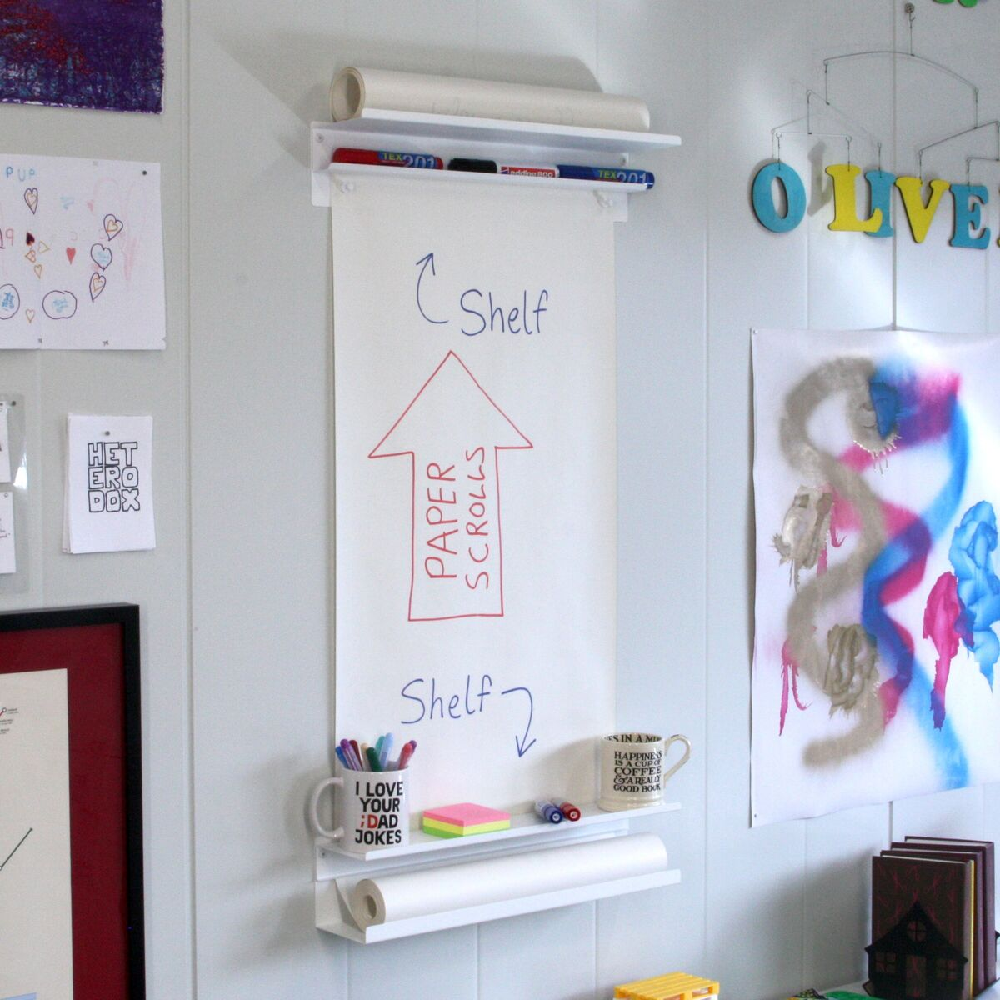

# VÄGGRULLE

A wall-mounted paper roll holder with a twist: paper feeds from the *bottom*, not the top. Fresh paper rolls up from a lower shelf, climbs the wall behind a small upper shelf, and the used portion winds itself onto a take-up roll at the top. Magnets hold the sheet flat so you can write on it like a whiteboard — but nothing ever needs to be erased.

Bottom-feed matches how we write: when you need more space, you pull more paper down from above what you've just written. Receipts, sketches and to-do lists all roll quietly into the archive, and you decide what to do with them when the roll runs out.

## Web links

- Buy them [ready made from us](https://shop.heterodox.se/products/vaggrulle-wall-roll-holder)

- [Project summary page on our website](https://www.heterodox.se/projects/vaggrulle/)

- [Watch pitch to IKEA on YouTube](https://www.youtube.com/watch?v=d2nPLcyNCWE)

## CAD files

The 3D designs are all in Onshape in a public document:

https://cad.onshape.com/documents/37ab526814be1d3adfa3d88a/w/21a39b4a91f2cb46bf5f886b/e/14498056990fb952585da8d3

This documentation refers to [version 1](https://cad.onshape.com/documents/37ab526814be1d3adfa3d88a/v/1ec049ebcb0c11318d4d0ec1/e/14498056990fb952585da8d3?showReturnToWorkspaceLink=true) of the design, later versions may differ.

## Documentation

- [Assembly instructions](./assembly-instructions.md) — how to mount the unit and load a paper roll.
- [Safety information](./safety.md) — customer-facing safety summary. Read before installing or using.
- [Safety information (all EU languages)](./safety-eu.md) — the same summary in English plus the 24 official EU languages.
- [Technical documentation](./technical-documentation.md) — dimensions, materials, trade codes, safety assessment.
- [Declaration of conformity](./declaration-of-conformity.md) — EU DoC.

## Bill of materials

- 4 × steel parts, 0.8 mm, punched, folded, powder-coated
- 4 × plastic spacers (set the paper feed gap)
- 4 × painted screws (suitable for wooden or thin sheet-metal walls; for masonry or plasterboard, use appropriate wall plugs)
- 2 × powder-coated magnets
- 1 × paper roll, 45 cm wide (e.g. IKEA MÅLA, article 704.610.88) — not supplied

All parts nest together and ship flat: 110 × 500 × 110 mm, approx. 2 kg.
