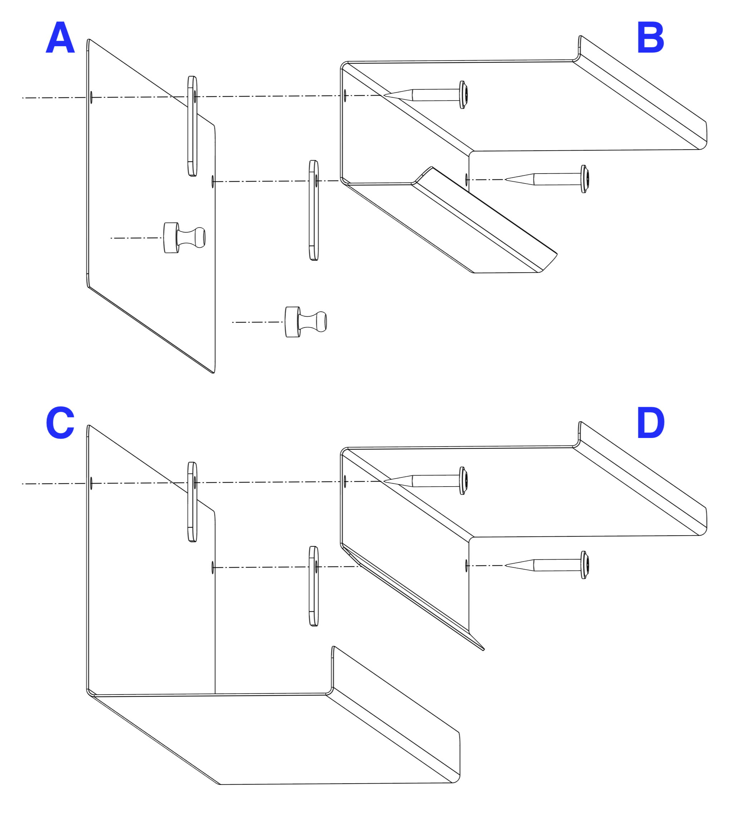

# VÄGGRULLE — Assembly instructions

## What's in the box

- 4 × powder-coated steel parts (labelled A–D in the exploded diagram below)
- 4 × plastic spacers
- 4 × painted screws (suitable for wooden or thin sheet-metal walls — for masonry or plasterboard, source appropriate wall plugs)
- 2 × powder-coated magnets

You will also need:

- A drill with a bit suited to your wall material
- A spirit level
- A pencil
- A screwdriver matching the supplied screws (PH2)
- One 45 cm wide paper roll, e.g. IKEA MÅLA (article 704.610.88)

## Choose a location

Pick a wall and a height that suits whoever will be writing on the unit most. The unit can be mounted high or low, on its own or above a desk.

The wall should be smooth enough so it is easy to write on, and resilient to any leaking through the paper by ink pens or tip pressure from other types of pen.

If there are children present ensure the top shelf is out of their reach. They should not be able to reach the magnets or pens you place on the top small shelf (eg permanent markers).

The mounting wall must be capable of supporting the weight of the unit plus the paper roll and items placed on the shelves.

## Note on fixings

The supplied screws are appropriate for the following walls:

- Wooden walls.
- Thin sheet-metal walls (the screws will self-tap).
- Plasterboard backed by plywood or OSB.

For other wall types please use appropriate fixings — the supplied screws may not hold.

## Assembly drawing

## Step 1 — mark the upper screw holes

1. Hold part A against the wall to determine where the top half will sit.
2. Use a spirit level to ensure it is horizontal.
3. Mark the wall through the holes to show where the screws will go.

## Step 2 — prepare the screw holes

1. If using the supplied screws, drive each one halfway in and then remove it to start the thread.
2. For other fixings (or if using wall plugs), drill the hole to the appropriate diameter and depth.

## Step 3 — mount the upper steel piece

1. Using a screw as a guide, assemble part A, one larger spacer and part B (see the exploded diagram).
2. Position the screw in the prepared hole and partially screw it in — leave a bit of slack.
3. Repeat with the second screw on the other side, again leaving slack.
4. Place a spirit level on the shelf, adjust until level, and tighten both screws.

## Step 4 — mount the lower steel piece

1. Mark and prepare the lower screw holes as above. Make sure they are vertically below the upper ones.
2. Assemble part C, the two smaller spacers and part D (see the exploded diagram), and fix to the wall in the same way.

## Step 5 — load the paper roll

1. Unroll a short length of paper from the roll and feed it up through the slot in the lower part.
2. Place the roll in the tray.
3. Pull the leading edge of the paper upwards, through the slot in the upper part, and let it roll back up on the top shelf.
4. Place the two magnets on the paper just below the upper shelf to hold the paper flat against the wall.
5. If the paper is loose, rotate the bottom roll slightly to create tension, then reposition the magnets.

## Using the unit

- To advance fresh paper: remove the magnets, gently rotate the top roll to pull paper up from the bottom, then replace the magnets.

## Safety notes

- Do not overload the shelves.
- Paper is flammable — keep sources of ignition away from the unit.
- Keep the magnets out of reach of small children. Keep them away from pacemakers, other implanted medical devices and magnetic storage media.
- This product is not a toy. Adult installation required.

For the full customer safety summary, see [safety.md](./safety.md).
